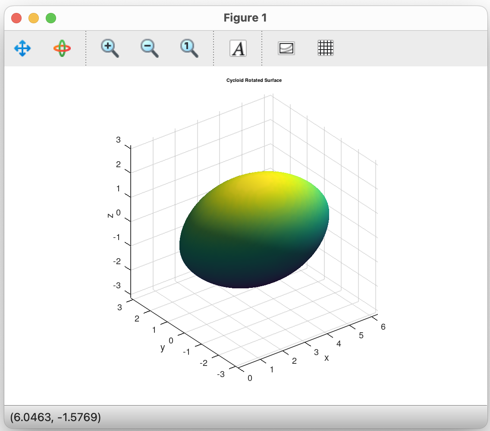

# Task 3
*[Fucntion CYCLOID]()
Create a CYCLOID function that makes it easy to draw a closed surface resulting from the rotation of one period of the cycloid
around the x-axis (the result is a single-color smooth surface that is displayed using the lighting model).

## Function:
```
function CYCLOID(r)
    t = linspace(0, 2*pi, 100);
    theta = linspace(0, 2*pi, 100);

    [T, Theta] = meshgrid(t, theta);

    X = r * (T - sin(T));
    Y = r * (1 - cos(T)) .* cos(Theta);
    Z = r * (1 - cos(T)) .* sin(Theta);

    surf(X, Y, Z);
    
    shading interp;        
    light;      
    lighting gouraud;      
    material dull;        
    axis equal;
    xlabel('x');
    ylabel('y');
    zlabel('z');
    title('Cycloid Rotated Surface');
end
```

## Run: 
```
radius = 1;
CYCLOID(radius);
```

Octave run:
```
octave:2> result
```

Plot:



Test:
```

```

