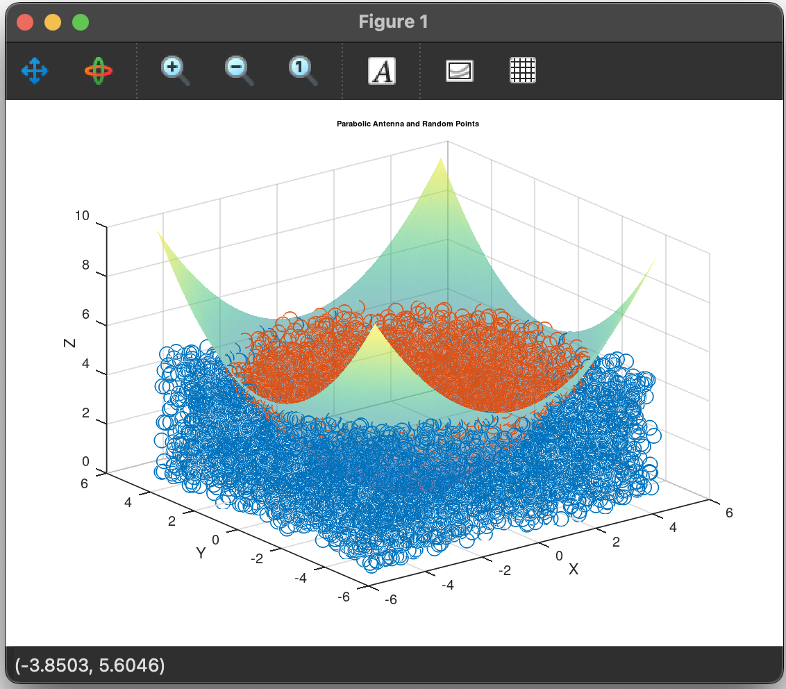

# Task 4
*[Fucntion estimateParabolicVolume](https://github.com/Yggdrasill501/matlab_math_tasks/blob/main/Task_4/estimateParaboloidVolume.m)* Using a random number generator, determine the volume of a parabolic antenna (rotating paraboloid like a water container)
with a diameter of d and a depth of h using a shot at a quadrilateral prism with an edge of d and a height of h. 
Repeat the shooting N times, draw in 3D the paraboloid and random points and the volume estimate.

## Function:
```
function [vol, figHandle] = estimateParaboloidVolume(d, h, N)
    x = d * rand(N, 1) - d/2;
    y = d * rand(N, 1) - d/2;
    z = h * rand(N, 1);

    inside = z <= 4*h/d^2 * (x.^2 + y.^2);

    volumePrism = d^2 * h;
    vol = sum(inside) / N * volumePrism;

    % Plotting
    figHandle = figure;
    [X, Y] = meshgrid(linspace(-d/2, d/2, 100), linspace(-d/2, d/2, 100));
    Z = 4*h/d^2 * (X.^2 + Y.^2);
    surf(X, Y, Z, 'FaceAlpha', 0.5, 'EdgeColor', 'none');
    hold on;
    scatter3(x(inside), y(inside), z(inside), 'g.');
    scatter3(x(~inside), y(~inside), z(~inside), 'r.');
    title('Parabolic Antenna and Random Points');
    xlabel('X');
    ylabel('Y');
    zlabel('Z');
    hold off;
end
```
Function estimateParaboloidVolume estimates the volume of a parabolic antenna (a rotating paraboloid) using 
the Monte Carlo method. It generates N random points within a prism defined by diameter d and height h, then calculates
the volume based on the proportion of points that fall inside the parabolic volume. Additionally, the function plots 
the paraboloid and the random points to visualize the estimation process, returning both the estimated volume and a
handle to the generated figure.

## Run: 
```
radius = 1;
CYCLOID(radius);
```
### Output:

#### Plot:



## Test:
```
diameter = 10;
depth = 5;
numPoints = 1000000;

for i = 1:5
    estimatedVolume = estimateParaboloidVolume(diameter, depth, numPoints);
    fprintf('Trial %d: Estimated Volume = %f\n', i, estimatedVolume);
end
```

### Test result: 
```
Trial 1: Estimated Volume = 303.720000
FALLBACK (log once): Fallback to SW vertex for line stipple
FALLBACK (log once): Fallback to SW vertex processing, m_disable_code: 2000
FALLBACK (log once): Fallback to SW vertex processing in drawCore, m_disable_code: 2000
Trial 2: Estimated Volume = 303.992500
Trial 3: Estimated Volume = 303.351000
Trial 4: Estimated Volume = 303.724500
Trial 5: Estimated Volume = 303.472000

```

